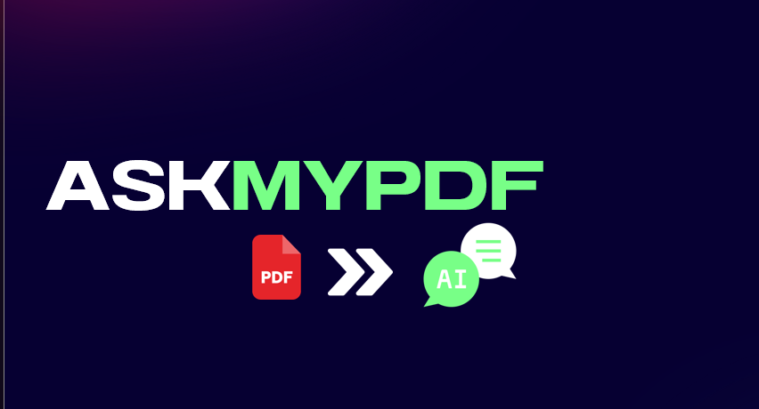

# AskmyPDF


Here is a full `README.md` file for your updated project with a **NestJS backend**, **Python processing**, and a **frontend UI** (React or other):

---

```markdown
# 📄 AskMyPDF – LLM-Powered PDF Q&A Platform

AskMyPDF is an AI-powered platform that lets you **ask natural language questions about your own PDFs**. It uses modern large language models (LLMs), embeddings, and a semantic search pipeline to deliver intelligent answers based on your documents.

---

## 🧠 Core Tech Stack

| Layer     | Tech                             |
|-----------|----------------------------------|
| Frontend  | React / Vue / Next.js + Tailwind |
| Backend   | NestJS (TypeScript)              |
| AI Engine | Python + LangChain + Groq (LLM)  |
| Embeddings| HuggingFace Transformers         |
| Vector DB | FAISS (local vector store)       |
| PDF Reader| PyPDF                            |

---

## 🔧 Features

- 📤 Upload your PDF documents
- 🤖 Ask contextual questions about them
- 🧠 Powered by LLaMA-3.1 via Groq API
- 💾 Local vector storage using FAISS
- 🛡️ Secure and modular NestJS API

---

## 🏗️ Project Structure

```

askmypdf/
├── frontend/              # React or Vue app for UI
├── backend/               # NestJS API (TS)
│   └── src/
│       ├── modules/
│       │   ├── pdf/       # Upload & vectorize PDF
│       │   ├── qa/        # Question answering logic
│       │   └── embeddings/
│       └── main.ts
├── process/               # Python scripts (LangChain)
│   ├── pdf\_reader.py
│   ├── embedder.py
│   ├── qa\_chain.py
├── vectorstore/           # FAISS .pkl files
├── .env                   # API keys and secrets
├── README.md
├── requirements.txt       # Python dependencies
└── .gitignore

````

---

## 🚀 Quick Start

### 1. Backend (NestJS)

```bash
cd backend
npm install
npm run start:dev
````

Ensure `.env` contains:

```env
GROQ_API_KEY=your_key_here
```

### 2. Frontend

```bash
cd frontend
npm install
npm run dev
```

Make sure it calls the NestJS backend at the correct port (e.g., `http://localhost:3000`).

### 3. Python Environment

```bash
python -m venv venv
source venv/bin/activate  # Windows: venv\Scripts\activate
pip install -r requirements.txt
```

Install core Python dependencies:

```
langchain
langchain-groq
faiss-cpu
torch
transformers
pypdf
```

---

## 🔌 API Endpoints

### `POST /upload`

Uploads and embeds a PDF file.

**Body**: `multipart/form-data` with PDF file

---

### `POST /ask`

```json
{
  "pdf_name": "Intro to ML v1",
  "question": "What is machine learning?"
}
```

**Response**:

```json
{
  "answer": "Machine learning is a field of AI that ..."
}
```

---

## 📸 Screenshots

> Add UI screenshots here if applicable

---

## 👥 Team

Made with ❤️ by the **Avengers** of AI 🚀

---

## 🛡️ License

MIT License

```
